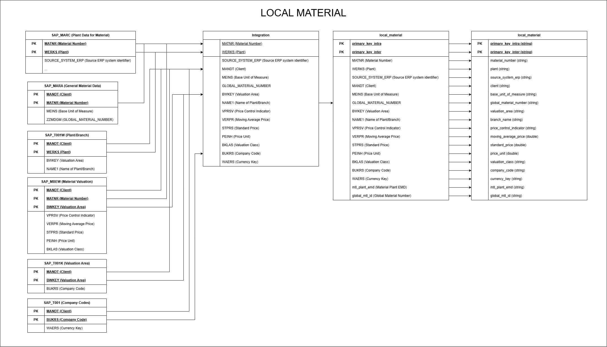
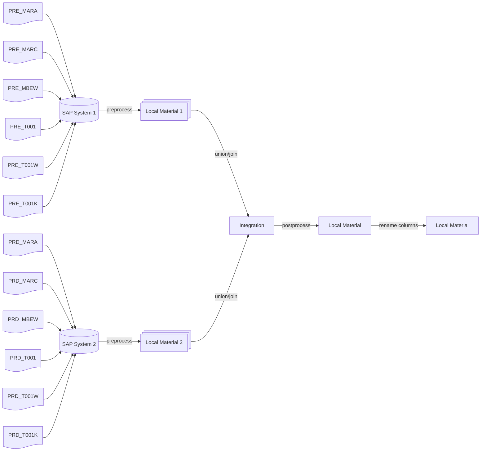
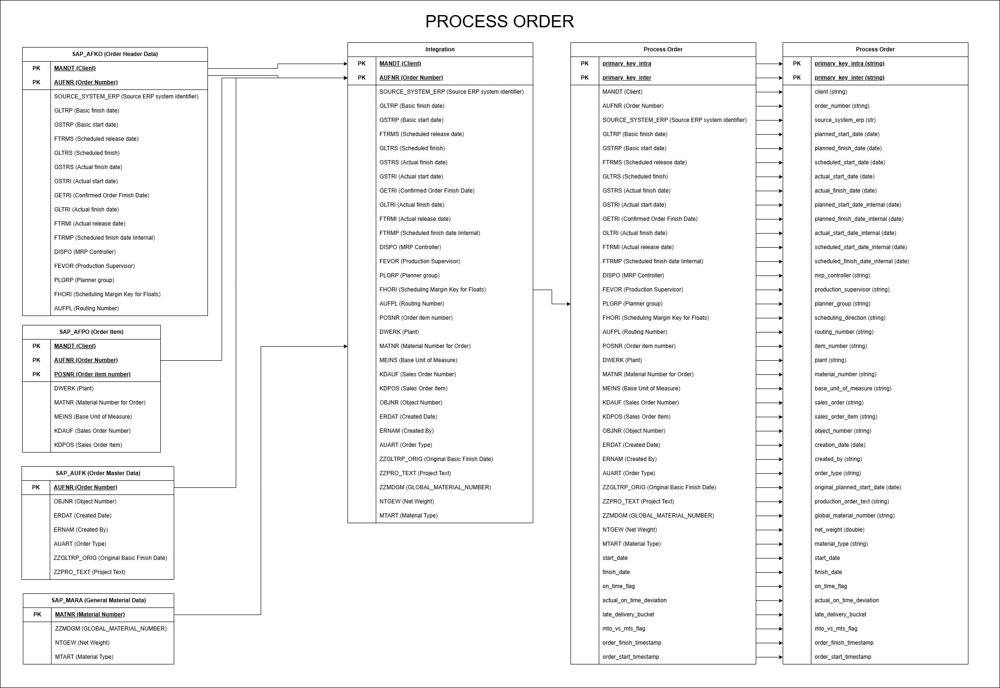
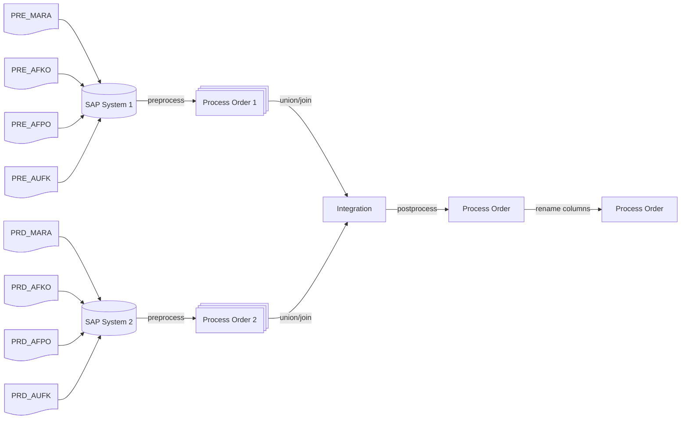

# Technical Case Study - SAP Data Integration

## Introduction

This project simulates an integration process between two SAP systems, focusing on local material data and process order data. The aim is to harmonize and preprocess SAP data to make it ready for further analysis and reporting.

### Project Goals

- Integrate data from SAP System 1 and SAP System 2.
- Harmonize and clean data (removing duplicates, renaming columns, adding primary keys).
- Perform data quality checks and handle sensitive data.
- Save the processed data for downstream analytics.

## Solution

Documentation about SAP Tables was looked up at the following link: [SAP Datasheet](https://www.sapdatasheet.org/)

The SAP Datasheet contains detailed information about various SAP tables, including their fields, data types, and usage within SAP systems. This is helpful for understanding how to integrate and transform data from SAP systems.

### Usage of SAP Tables

The following SAP tables are used in the integration process:

for Local Material Data:

- `MARC` - Plant Data for Material
- `MARA` - General Material Data
- `MBEW` - Material Valuation
- `T001` - Company Codes
- `T001W` - Plants/Branches
- `T001K` - Valuation Area

for Process Order Data:

- `AFKO` - Order Header Data
- `AFPO` - Order Item Data
- `AUFK` - Order Master Data
- `MARA` - General Material Data

### Diagrams & Data Flows

The `diagrams` folder contains the following diagrams created by draw.io:

- diagram_local_material.png
- diagram_process_order.png

Dataflow diagrams are made using [mermaid.js](https://mermaid.js.org/) syntax.

#### Diagram - Local Material

The diagram displays how the columns from SAP Tables are joined, renamed and integrated to create the final Local Material dataset.



#### Data Flow - Local Material



The process begins with data coming from two separate SAP systems, SAP System 1 and SAP System 2. The data is preprocessed and harmonized to create a unified dataset. The final dataset is then postprocessed and renamed to create the final Local Material. The final dataset is saved as a CSV file in the `data/output/local_material` folder.

#### Diagram - Process Order

The Diagram displays how data is joined and integrated between different SAP tables to create the final Process Order dataset.



#### Data Flow - Process Order



The process begins with data coming from two separate SAP systems, SAP System 1 and SAP System 2. The data is preprocessed and harmonized to create a unified dataset. The final dataset is then postprocessed and renamed to create the final Process Order. The final dataset is saved as a CSV file in the `data/output/process_order` folder.

## What can be improved?

- **Add Metadata Columns**: Add metadata columns to the table to track changes and updates and lineage.
    - E.g. Created Date, Updated Date, Created By, Updated By, Source System, Source Table
- **Define Schema on Read**: Schema can be defined at read time to avoid inferring schema. Schema parameter is already implemented in the `read_csv_file` function.
- **Data Quality Checks**: More data quality checks can be added to ensure data consistency and accuracy. E.g. checking for null values, data types, etc.
- **Performance Optimization**: Performance can be optimized by using partitioning, bucketing, and caching.
- **Using broadcast joins**: For smaller tables, broadcast joins can be used to improve performance.
- **Spark Configuration**: Spark configuration can be optimized for better performance.
- **CI/CD Pipeline**: Implement a CI/CD pipeline for automated code linting, testing and deployment with approval process.
- **Save to Database**: Save the final dataframes to a database for further analysis and reporting.E.g. Open Table Formats, Delta Lake, Apache Iceberg.
- **Monitoring and Alerting**: Implement monitoring and alerting for the Spark application to track performance and errors. E.g. Prometheus, Grafana, ELK Stack. As well for the data pipeline.
- **Processing Database**: Save runtime metadata to a processing database for tracking and monitoring.
    - E.g. Run id, Start Time, End Time, Status, Error Message, Processed Rows, Rejected Rows, Source Table, Target Table
- **Credentials Management**: Use key vaults or secret management tools to store and manage credentials securely. E.g. AWS Secrets Manager, Azure Key Vault.

## Setup

### Prerequisites

Docker and Docker Compose are chosen as the primary tools for running the code. This makes it easier to run the code in a containerized environment. Otherwise setting up spark and other dependencies can be cumbersome on a local machine.

- Docker -> [Install Docker](https://docs.docker.com/get-docker/)
- Docker Compose -> [Install Docker Compose](https://docs.docker.com/compose/install/)
- Docker Image -> jupyter/pyspark-notebook:python-3.11
- Python 3.11

### Code Setup and Structure

The code is structured as follows:

- `code` folder contains code related files.
    - `main.py` is the entrypoint for the code.
    - `modules` folder contains the main modules.
        - `local_material.py` contains the code for local material.
        - `process_order.py` contains the code for process order.
        - `utils.py` contains the utility functions.
    - `tests` folder contains the tests for the modules.
        - `test_local_material` folder contains the tests for local material.
        - `test_process_order` folder contains the tests for process order.
        - `test_utils.py` contains the tests for the utility functions.
        - `conftest.py` contains the fixtures for the tests.
- `data` folder contains the data.
- `diagrams` folder contains the diagrams.
- `docs` folder contains the documentation.
- `scripts` folder contains the scripts.
- `requirements.txt` contains the dependencies.

Final dataframes  **local_material** and **process_order** are saved in the `data/output` folder as `csv` files.

#### Data Quality Checks

Uniqueness checks are performed on the primary keys of the dataframes using `check_columns_unique`.
More checks could be added as functions to check for null values, data types, etc.

Besides custom checks spark test frameworks can be utilized. Some examples frameworks are `Great Expectations`, `spark-expectations` or `soda-spark`.

#### Sensitive Data Handling

Masking is performed on the sensitive columns using `mask_sensitive_columns` function.
This is done to ensure that sensitive data is not exposed in the final dataframes.
Should be done as early as possible in the pipeline.

### Code Quality, Style and Linting

`ruff` library is used for linting and code quality checks. You can run it using `ruff` command.

It is configured to use Google Style Code and Docstrings.

```bash
ruff check ./code
```

### Generating and viewing documentation

`mkdocs` library is used to generate documentation. 

> MkDocs is a fast, simple and downright gorgeous static site generator that's geared towards building project documentation. Documentation source files are written in Markdown, and configured with a single YAML configuration file.


To generate and view the documentation, run the following command:

```bash
docker-compose up docs --build --no-log-prefix
```

And visit [http://localhost:8000](http://localhost:8000) in your browser.

To generate a `site` folder at the root level containing the documentation, which can be published on **GitHub Pages**, following command can be used:

Note: This is not implemented in docker-compose.yaml yet.

```bash
mkdocs build
```

### Running the tests

- The code is tested using Pytest. You can run the tests using the following command:

```bash
docker-compose up spark-test --build --no-log-prefix
```

Test results are generated and exported as HTML to logs folder.

### Running the code

The code is written in Python 3.11. `jupyter/pyspark-notebook` docker image is being used to run the code. This helps in running the code in a containerized environment. And avoids
installing dependencies like spark, java, hadoop utils on the local machine.

The entypoint for the code is `main.py`.

You can run the spark application using the following command:

```bash
docker-compose up spark-run --build --no-log-prefix
```

### Cleaning up

To clean up the docker containers, run the following command:

```bash
docker-compose down
```

## Project Tree

The project tree is as follows:

```bash
.
├── Dockerfile
├── README.md
├── Technical-Case-Study.pdf
├── code
│   ├── __init__.py
│   ├── main.py
│   ├── modules
│   │   ├── __init__.py
│   │   ├── local_material.py
│   │   ├── process_order.py
│   │   └── utils.py
│   └── tests
│       ├── __init__.py
│       ├── conftest.py
│       ├── test_local_material
│       │   ├── __init__.py
│       │   ├── test_derive_intra_and_inter_primary_key.py
│       │   ├── test_integration.py
│       │   ├── test_post_prep_local_material.py
│       │   ├── test_prep_general_material_data.py
│       │   ├── test_prep_material_valuation.py
│       │   ├── test_prep_plant_and_branches.py
│       │   ├── test_prep_plant_data_for_material.py
│       │   └── test_prep_valuation_data.py
│       ├── test_process_order
│       │   ├── __init__.py
│       │   ├── test_integration.py
│       │   ├── test_post_prep_process_order.py
│       │   ├── test_prep_sap_general_material_data.py
│       │   ├── test_prep_sap_order_header_data.py
│       │   ├── test_prep_sap_order_item_data.py
│       │   └── test_prep_sap_order_master_data.py
│       └── test_utils.py
├── data
│   ├── output
│   │   ├── local_material
│   │   │   ├── _SUCCESS
│   │   │   └── part-00000-5064d33b-f9c6-437a-8cc3-ffeeaf7edfb4-c000.csv
│   │   └── process_order
│   │       ├── _SUCCESS
│   │       └── part-00000-384db7a3-a438-4fa6-a7db-be4874b4a3b0-c000.csv
│   ├── system_1
│   │   ├── PRE_AFKO.csv
│   │   ├── PRE_AFPO.csv
│   │   ├── PRE_AUFK.csv
│   │   ├── PRE_MARA.csv
│   │   ├── PRE_MARC.csv
│   │   ├── PRE_MBEW.csv
│   │   ├── PRE_T001.csv
│   │   ├── PRE_T001K.csv
│   │   └── PRE_T001W.csv
│   ├── system_2
│   │   ├── PRD_AFKO.csv
│   │   ├── PRD_AFPO.csv
│   │   ├── PRD_AUFK.csv
│   │   ├── PRD_MARA.csv
│   │   ├── PRD_MARC.csv
│   │   ├── PRD_MBEW.csv
│   │   ├── PRD_T001.csv
│   │   ├── PRD_T001K.csv
│   │   └── PRD_T001W.csv
│   └── test
│       └── test_data.csv
├── diagrams
│   ├── diagram_local_material.drawio
│   ├── diagram_local_material.png
│   ├── diagram_process_order.drawio
│   └── diagram_process_order.png
├── docker-compose.yaml
├── docs
│   ├── assets
│   │   └── image
│   │       ├── diagram_local_material.png
│   │       └── diagram_process_order.png
│   └── index.md
├── mkdocs.yml
├── pyproject.toml
├── requirements.txt
├── ruff.toml
└── scripts
    ├── entrypoint.sh
    └── gen_ref_nav.py
```

## Troubleshooting

If you run into issues with Docker, check the following:

Ensure Docker is running and you have sufficient system resources allocated.
Verify that all files are correctly mounted into the Docker containers.
Check the logs for any errors or exceptions.
